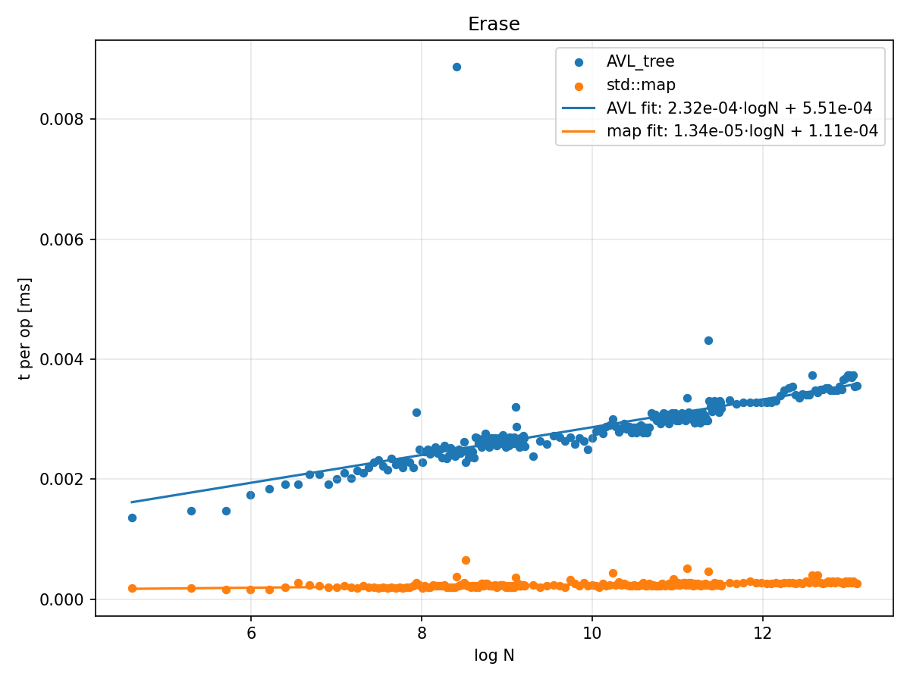

# AVL Tree Benchmark

Implementation of **AVL tree** in C++ with benchmarking against `std::map`.  
Includes performance tests for **insert**, **find**, and **erase** operations,  
plus Python scripts to visualize results.

## 📊 Example Plots

### Insert

### Find

### Erase

